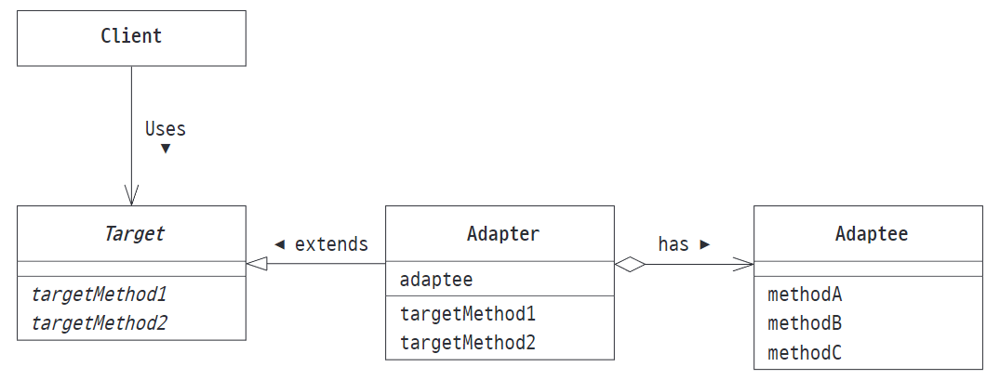

# Adapter 패턴

### 클래스에 의한 adapter 패턴 (상속을 위함)

### 인스턴스에 의한 adapter 패턴 (위임을 위함)

### 정리

1. **어떤 경우에 사용하는가?**
      기존 소스를 전혀 수정하지 않고 목적한 인터페이스에 맞추기 위함, 객체지향의 원칙.
2. **상속과 위임 어느 쪽을 사용해야 할까?**
     일반적으로 상속보다 위임을 사용하는 게 문제가 적다 ( 상속보다 컴포지션을 사용하라 )
     상속을 사용하면, 상위 클래스의 내부 동작에 의해 영향을 받기 때문
3. 관련 패턴은?  
   Bridge 패턴 : 기능 계층과 구현 계층을 연결함 (어답터는 인터페이스가 서로 다른 클래스를 연결)
   Decorator 패턴 : 인터페이스를 변경하지 않고 기능을 추가함 (어답터는 인터페이스의 차이를 메움)

adapter 패턴은 wrapper 패턴이라고도 한다
