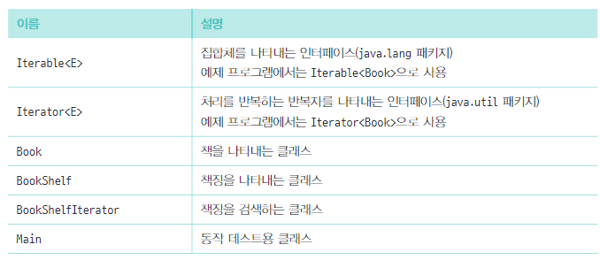

# Iterator 패턴

> 순서대로 가리키며 전체를 검색하고 처리를 반복하는 것  
> 단순하게, for() 문을 생각하면 됨


* 인터페이스 목록




* 개념
1. Iterator :  Iterator란 자바의 컬렉션(Collection)에 저장되어 있는 요소들을 순회하는 인터페이스이다.
2. Iterator : 반복자, 요소를 순서대로 검색하는 인터페이스 [ Iterator<E> 클래스]
3. Concretelterator : 구체적인 반복자, 위 인터페이스를 실제로 구현 [ BookShelfIterator 클래스 ]
4. Aggregate : 집합체, 내가 가진 요소를 차례로 검색해주는 애 [ Iterable ]
5. ConcreteAggregate : 구체적인 집합체, Aggregate가 결정한 인터페이스를 구현한 놈 [ BookShelf 클래스 ]

> 구체적인 클래스가 아닌, 추상클래스나 인터페이스를 사용하여 프로그래밍 한다
> <br> 재사용과 코드의 유지보수를 용이하게 함


```java
public class Main
{
    public static void main(String[] args)
    {
        // 컬렉션 생성
        ArrayList<String> cars = new ArrayList<>();
        cars.add("벤츠");
        cars.add("람보르기니");
        cars.add("롤스로이스");
        cars.add("페라리");

        // iterator 획득
        Iterator<String> iterator = cars.iterator();

        // case 1
        while(iterator.hasNext())
        {
            String str = iterator.next();
            System.out.println(str);
        }

        // case 2
        for (String str : cars)
        {
            System.out.println(str);
        }
    }

}
```

* 정리
1. Iterator 을 상속해서 사용하면 무슨 이점인데 그래서
   <br> 반복문과 구현체를 분리할 수 있기 때문 => 재사용, 유지보수
   <BR> hasNext(), next() 를 이용하여 반복문을 구성하므로써 Book 이 배열이든 list든 알바 아니다.
2.  Iterator는 컬렉션 프레임워크에 대한 인터페이스이고, 사용법이 쉽다.
    <br> 하지만 반복문보다 속도면에서 조금 느리다는 평이 있다.