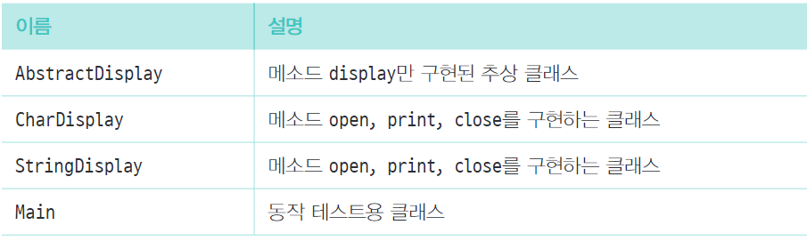

# Template Method 패턴

상위 클래스에서 처리의 뼈대를 경정하고 하위 클래스에서 구체적인 내용을 결정하는 디자인 패턴  
상위 클래스 쪽에 탬플릿이 될 메소드가 정의되어 있고 그 메소드 정의에 추상 메소드가 사용됨.  
따라서 사우이 클래스의 코드으론 어떻게 처리되는지 알 수 없음 (추상 메서드를 호출하는 방법만 알 수 있음)

### 정리
1. 사용 이유?  
   상위-하위 클래스의 협조를 위해.
2. 주의점?
   상속으로 상위-하위 클래스가 긴밀하게 연계하여 움직임.  
   그렇기 때문에 상위 클래스에서 어떤 타이밍에 호출되는지 이해해야 됨.
3. 하위클래스를 상위클래스와 동일시한다
   instanceof 등으로 하위 클래스의 종류를 특정하지 않아도 됨 (LSP 원칙)
4. 관련 패턴?  
   1. Factory Method 패턴
   2. Strategy 패턴

### 참고
https://engineering.linecorp.com/ko/blog/templete-method-pattern